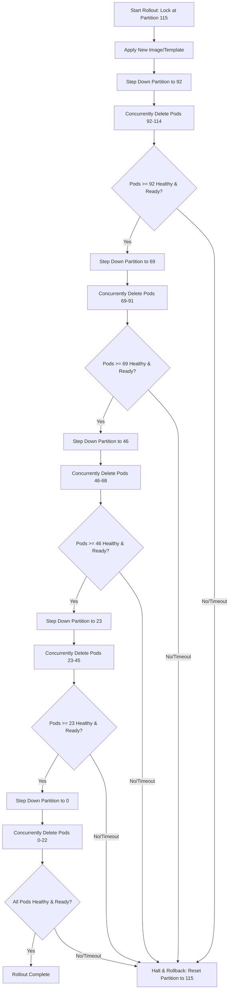

# Workaround Guide: StatefulSet Parallel Rollouts via Partition Stepping

---

## Section 0: Before You Begin — Prerequisites & Compatibility Gotchas

**Read this before Section 1.** This workaround manipulates a live production StatefulSet with manual pod deletions. Several properties of your cluster and your StatefulSet determine whether the procedure will run as documented, run in a degraded way, or silently fail to produce parallel updates. Because these vary by environment, validate every item below on the actual target cluster first. A copy-paste pre-flight script is provided in [Section 0.5](#05-one-shot-pre-flight-check).

---

### 0.1 The one that stops everything: `podManagementPolicy` is immutable

The entire mechanism depends on `spec.podManagementPolicy: Parallel`. This field **cannot** be changed on an existing StatefulSet — Kubernetes rejects any attempt to patch it. If your StatefulSet was created with the default (`OrderedReady`), deleting a batch of pods will recreate them one at a time, in ascending ordinal order, and the workaround delivers **no speedup whatsoever**.

**Check it:**

```bash
kubectl get statefulset <name> -n <namespace> \
  -o jsonpath='{.spec.podManagementPolicy}'
# Expected: "Parallel". Empty or "OrderedReady" = blocker.
```

If it returns `OrderedReady`, you must **re-create** the StatefulSet object to change the policy. This can be done without restarting the running pods by orphaning them, because the new object adopts the existing pods as long as the selector is identical:

```bash
# 1. Back up the live object
kubectl get statefulset <name> -n <namespace> -o yaml > sts-backup.yaml

# 2. Copy it, set spec.podManagementPolicy: Parallel, and strip the runtime
#    fields: status, metadata.uid, metadata.resourceVersion,
#    metadata.creationTimestamp, metadata.generation, managedFields.
#    DO NOT change spec.selector or the pod template labels.

# 3. Delete the StatefulSet but LEAVE the pods and PVCs running
kubectl delete statefulset <name> -n <namespace> --cascade=orphan

# 4. Recreate from the edited manifest; it will adopt the orphaned pods
kubectl apply -f sts-parallel.yaml
```

**Cautions.** Do this in a maintenance window and rehearse in non-prod first. While the object is deleted (step 3→4) nothing reconciles the pods, so avoid node disruptions during that gap. If the selector or labels differ even slightly, the new StatefulSet will not adopt the old pods and will create duplicates. If this StatefulSet is GitOps-managed (see [0.3](#03-gke--platform-conditions-that-will-block-or-fight-the-procedure)), do this change through Git, not imperatively.

---

### 0.2 Other StatefulSet properties that must be true

| **Property** | **Required for the procedure** | **How to check** | **If it's wrong** |
|---|---|---|---|
| **Update strategy** | `RollingUpdate` (the `partition` field lives under it) | `kubectl get sts <name> -n <ns> -o jsonpath='{.spec.updateStrategy.type}'` | If `OnDelete`, the partition steps do nothing. Use the OnDelete variant in [0.6](#06-simpler-alternative-when-the-statefulset-uses-ondelete) instead. |
| **Start ordinal** | Default `0`, so pods are `name-0` … `name-(N-1)` | `kubectl get sts <name> -n <ns> -o jsonpath='{.spec.ordinals.start}'` | If non-empty (e.g. `5`), the StartOrdinal feature is in use and pod names are shifted. **Every `seq`/delete range in the guide must be offset by that number.** |
| **Replica count** | Matches the N used for batch math (guide assumes 115) | `kubectl get sts <name> -n <ns> -o jsonpath='{.spec.replicas}'` | Recompute the partition steps (`N`, `N−23`, …) for the real replica count. |
| **maxUnavailable still set** | Harmless no-op today; reactivates on GKE 1.37 | `kubectl get sts <name> -n <ns> -o jsonpath='{.spec.updateStrategy.rollingUpdate.maxUnavailable}'` | None needed — leave it; it becomes active again once the feature gate is re-enabled. |
| **Readiness Probe** | Must be configured and accurately reflect app readiness | `kubectl get sts <name> -n <ns> -o jsonpath='{.spec.template.spec.containers[*].readinessProbe}'` | If missing/poorly configured, the script will assume pods are healthy immediately, potentially routing traffic to unready pods. Define a proper readiness probe. |

---

### 0.3 GKE / platform conditions that will block or fight the procedure

These are environment-level and are the most common reason the runbook "doesn't work" in a customer cluster.

**GitOps or an operator manages this StatefulSet — this will silently undo your work.** If the StatefulSet is reconciled by Argo CD, Config Sync, Flux, or a custom operator, your imperative `kubectl patch` of the partition will be reverted to the Git-declared value mid-rollout, stranding the rollout in a half-updated state. Detect the manager and pause it first:

```bash
kubectl get statefulset <name> -n <namespace> \
  -o jsonpath='{range .metadata.managedFields[*]}{.manager}{"\n"}{end}' |
  sort -u
# Watch for: argocd-controller, configsync, flux / kustomize-controller, or an
# operator name.
```

If found, pause reconciliation for the window (e.g. Argo CD: disable auto-sync / `argocd app set <app> --sync-policy none`; Config Sync: pause the RootSync/RepoSync; Flux: `flux suspend kustomization <name>`), or drive the whole rollout through Git instead.

**Autopilot vs. Standard.** The guide's "pause node auto-upgrade / coordinate node operations" advice assumes a Standard cluster. On Autopilot, node lifecycle and bin-packing are fully Google-managed, you cannot pause node auto-upgrade the same way, and mass pod deletion can trigger aggressive node scale-up/down. Confirm the mode and adjust expectations:

```bash
gcloud container clusters describe <cluster> --location <region-or-zone> \
  --format='value(autopilot.enabled)'  # True = Autopilot
```

**RBAC.** The identity running the script needs `patch` on `statefulsets` and `delete` on `pods` in the namespace. On locked-down clusters this is often denied:

```bash
kubectl auth can-i patch statefulsets -n <namespace>
kubectl auth can-i delete pods -n <namespace>
```

**Admission control / Policy Controller / sidecar injection.** A validating webhook or Anthos Policy Controller (Gatekeeper) constraint can reject recreated pods (missing labels, disallowed images, etc.), and a slow or failing mutating webhook — including service-mesh sidecar injection (Istio / Cloud Service Mesh) — can keep recreated pods from ever reaching Ready, which will trip the script's timeout and fire a spurious rollback. Spot-check what's in play:

```bash
kubectl get validatingwebhookconfigurations
kubectl get mutatingwebhookconfigurations
kubectl get constraints 2>/dev/null  # if Policy Controller / Gatekeeper is installed
```

**Node auto-upgrade, auto-repair, and autoscaler.** Because direct pod deletion bypasses PodDisruptionBudgets, any other node operation during the window can remove pods on top of your 20% batch with no protection. Pause all three for the rollout — not just auto-upgrade: node auto-upgrade, node auto-repair, and cluster-autoscaler scale-down (e.g. annotate nodes with `cluster-autoscaler.kubernetes.io/scale-down-disabled=true`).

---

### 0.4 Storage & scheduling conditions that can stall a batch

These don't block the start, but they routinely cause a batch to hang and trigger a false rollback.

**Persistent Disk attach / multi-attach (the guide understates this).** If the StatefulSet has `volumeClaimTemplates`, each deleted pod's ReadWriteOnce Persistent Disk must detach from the old node before it can attach to the new one. When 23 pods are deleted at once and the scheduler places replacements on different nodes, you can hit `Multi-Attach error for volume` and attach/detach stalls of several minutes — not the "minor latency" the body text suggests. Zonal PDs add a hard constraint: a replacement scheduled into a different zone than its disk cannot attach at all. Mitigations: raise the script's `--timeout` well above the default 300s when PVCs are present, prefer storage classes with `volumeBindingMode: WaitForFirstConsumer`, and keep replacements zone-aligned.

```bash
kubectl get sts <name> -n <ns> -o \
  jsonpath='{.spec.volumeClaimTemplates[*].metadata.name}'
```

**Anti-affinity + capacity.** If the pod template uses `requiredDuringScheduling` pod anti-affinity (e.g. one-pod-per-node) and the cluster has no spare schedulable nodes, the 23 recreated pods will sit `Pending` until the autoscaler adds capacity — and if you paused scale-down/scale-up, they may never schedule. Confirm there is headroom (or leave scale-up enabled).

**Graceful shutdown & timeouts.** `kubectl delete pods` defaults to `--wait=true`, so the delete call blocks for `terminationGracePeriodSeconds`. A long grace period (e.g. for connection draining) lengthens each batch; make sure the script `--timeout` exceeds grace + readiness. If `spec.minReadySeconds` is set, a pod isn't "available" until it elapses — factor it into the timeout.

---

### 0.5 One-shot pre-flight check

Run this against the target cluster/namespace before doing anything. It flags every blocker above.

```bash
#!/bin/bash
# Usage: ./preflight.sh <statefulset-name> <namespace>
STS="$1"; NS="${2:-default}"
echo "Pre-flight check for StatefulSet '$STS' in namespace '$NS'"
echo "============================================================"

PMP=$(kubectl get sts "$STS" -n "$NS" -o jsonpath='{.spec.podManagementPolicy}' 2>/dev/null)
[ -z "$PMP" ] && PMP="OrderedReady"
if [ "$PMP" = "Parallel" ]; then echo "[PASS] podManagementPolicy = Parallel"
else echo "[FAIL] podManagementPolicy = $PMP -> IMMUTABLE: recreate the StatefulSet (Section 0.1)"; fi

UST=$(kubectl get sts "$STS" -n "$NS" -o jsonpath='{.spec.updateStrategy.type}' 2>/dev/null)
[ -z "$UST" ] && UST="RollingUpdate"
if [ "$UST" = "RollingUpdate" ]; then echo "[PASS] updateStrategy.type = RollingUpdate"
else echo "[WARN] updateStrategy.type = $UST -> use the OnDelete variant (0.6); partition steps do not apply"; fi

ORD=$(kubectl get sts "$STS" -n "$NS" -o jsonpath='{.spec.ordinals.start}' 2>/dev/null)
if [ -z "$ORD" ] || [ "$ORD" = "0" ]; then echo "[PASS] ordinals.start = 0 (pods are $STS-0 .. N-1)"
else echo "[FAIL] ordinals.start = $ORD -> shift every delete/seq range by +$ORD"; fi

REP=$(kubectl get sts "$STS" -n "$NS" -o jsonpath='{.spec.replicas}' 2>/dev/null)
echo "[INFO] replicas = ${REP:-unknown} (guide batch math assumes this is N)"

MGRS=$(kubectl get sts "$STS" -n "$NS" -o jsonpath='{range .metadata.managedFields[*]}{.manager}{"\n"}{end}' 2>/dev/null | sort -u | paste -sd, -)
echo "[INFO] field managers: ${MGRS:-none}"
echo "  -> if argocd/configsync/flux/kustomize-controller appears, PAUSE GitOps first (Section 0.3)"

PVCS=$(kubectl get sts "$STS" -n "$NS" -o jsonpath='{.spec.volumeClaimTemplates[*].metadata.name}' 2>/dev/null)
if [ -z "$PVCS" ]; then echo "[PASS] no volumeClaimTemplates (no Persistent Disk attach risk)"
else echo "[WARN] uses PVCs ($PVCS) -> raise --timeout; expect PD detach/attach on reschedule (Section 0.4)"; fi

echo "[INFO] can patch sts: $(kubectl auth can-i patch statefulsets -n "$NS" 2>/dev/null)"
echo "[INFO] can delete pods: $(kubectl auth can-i delete pods -n "$NS" 2>/dev/null)"

READINESS=$(kubectl get sts "$STS" -n "$NS" -o jsonpath='{.spec.template.spec.containers[*].readinessProbe}' 2>/dev/null)
if [ -n "$READINESS" ]; then echo "[PASS] Readiness probe is configured"
else echo "[WARN] No readiness probe configured! Script health checks may be unreliable (Section 0.2)"; fi
```

Resolve every `[FAIL]`, and consciously accept or mitigate every `[WARN]`, before proceeding to Section 1.

---

### 0.6 Simpler alternative when the StatefulSet uses OnDelete

If your StatefulSet's `updateStrategy.type` is already `OnDelete` (or you're willing to set it), you do not need the partition-stepping dance. With `OnDelete` + `podManagementPolicy: Parallel`, the controller never auto-updates pods; it only recreates the ones you delete — and recreation honors `Parallel`, so a deleted batch comes back concurrently on the new revision. Update the template, then delete in batches of 23 with the same health gate between batches.

**Trade-off:** partition gives one extra safety guarantee that OnDelete does not — a pod below the partition that gets deleted by something else (node failure, autoscaler) is recreated on the **old** revision, keeping the blast radius bounded during a partial rollout. With OnDelete, any incidentally deleted pod returns on the **new** revision. Choose partition (the main guide) for the tighter control; choose OnDelete for fewer moving parts.

---

### 0.7 Upgrade timeline

The body of this guide references "GKE v1.37 (expected late August 2026)." Please read that as **upstream Kubernetes 1.37 GA** (scheduled 26 August 2026), which is **not** the date the version is available on GKE.

GKE makes a new minor available on the **Rapid** channel weeks to roughly two months after upstream GA, and on **Regular/Stable** months later. Plan for GKE 1.37 on Rapid around **Q4 2026 at the earliest**, with Regular/Stable later — do not schedule around late August.

**GKE 1.36 will not restore parallel updates.** The permanent code fix (PR #137666) ships in 1.36, but the feature default has not been re-enabled in 1.36. It will be re-enabled in 1.37, which has an end of August release date. Additionally, because of the two-minor version skew policy, customers will need to upgrade their nodes to at least 1.35 to reach 1.37.

Re-enablement at 1.37 follows upstream, but whether GKE keeps a beta gate on at launch is ultimately a GKE qualification decision. Treat "native fix on GKE 1.37" as the **expected — not guaranteed** — outcome, and keep this workaround available until you've confirmed parallel rollouts work on your actual GKE 1.37 build.

---

## 1. Context & Background

Following the upgrade of your GKE control plane to GKE v1.35.5 (or any v1.35+ release), you may observe a severe degradation in rollout velocity for StatefulSets configured with `podManagementPolicy: Parallel` and `spec.updateStrategy.rollingUpdate.maxUnavailable`. Despite having `maxUnavailable` set (e.g. 20%), the StatefulSet updates only **one pod at a time**.

This regression causes deployment times to escalate from minutes to potentially **hours** for large StatefulSets, severely impacting operational velocity and CI/CD pipelines.

### Why did this happen?

This behavior is due to an upstream Kubernetes change ([PR #137904](https://github.com/kubernetes/kubernetes/pull/137904)) that **disabled** the `MaxUnavailableStatefulSet` feature gate by default in Kubernetes v1.35. This feature gate was demoted to mitigate a critical upstream bug ([Issue #137409](https://github.com/kubernetes/kubernetes/issues/137409)) where unavailable old-revision pods could indefinitely block rollouts under Parallel pod management.

While a permanent, safe fix has been merged in upstream Kubernetes v1.36+ ([PR #137666](https://github.com/kubernetes/kubernetes/pull/137666)), GKE will re-enable the `MaxUnavailableStatefulSet` feature gate by default in **GKE v1.37** (expected late August 2026).

Although GKE supports a node-to-control-plane version skew of up to two minor versions (allowing v1.34 nodes to run with a v1.36 control plane), upgrading the control plane to v1.37 to get the fix will require upgrading your node pools to at least v1.35 to remain within the supported version skew. Therefore, upgrading immediately to a version containing the fix is not a viable short-term option.

---

## 2. The Solution: Partition Stepping + Targeted Deletions

This workload-layer workaround restores fast, parallel deployments immediately using native Kubernetes primitives, without requiring a platform upgrade or introducing additional feature risk to your fleet. It leverages **Partitioned StatefulSet Updates** combined with **targeted concurrent Pod deletions**.

### How the Workaround Works

- **`podManagementPolicy: Parallel`**: This tells the StatefulSet controller to create or terminate pods concurrently, bypassing the sequential (0 to N-1) ordering during scaling or recovery operations.

- **`spec.updateStrategy.rollingUpdate.partition`**: This defines an ordinal partition. When the StatefulSet template is updated, only pods with an ordinal index **greater than or equal to** the partition are updated. Pods with an index less than the partition remain untouched.

### The Partition Stepping Mechanism

This workaround, referred to as **Partition Stepping**, combines native partition settings with manual deletions to bypass the disabled feature gate.

If you simply step down the partition value, the StatefulSet controller will update the pods. However, because the `maxUnavailable` feature gate is disabled, the controller will still update them **one-by-one** (sequentially) down to the partition limit.

**To force parallel updates, we must:**

1. **Decrease the partition** to allow a batch of pods to opt-in to the new template.
2. **Manually delete** that entire batch of pods concurrently.
3. Because `podManagementPolicy` is `Parallel`, the controller immediately detects the missing pods and **recreates them in parallel** (concurrently).
4. Because their ordinals are greater than or equal to the partition, they are recreated using the **new template**.
5. Once the batch is healthy, we **repeat** the process for the next batch.

### Rollout Workflow (115 Replicas, 20% / 23-Pod Batches)



---

## 3. Step-by-Step Manual Execution

### Step 1: Lock the Rollout and Apply the Template

Before deploying your update, modify your StatefulSet manifest to set the partition to the total number of replicas (115). This "locks" the rollout, preventing the controller from starting a slow, automatic one-by-one update.

```yaml
apiVersion: apps/v1
kind: StatefulSet
metadata:
  name: <name>
  namespace: default
spec:
  replicas: 115
  podManagementPolicy: Parallel
  updateStrategy:
    type: RollingUpdate
    rollingUpdate:
      partition: 115  # Set to N (total replicas) to lock rollout
  template:
    spec:
      containers:
      - name: <name>
        image: <registry/image:new-tag>  # Your new image
```

Apply this manifest:

```bash
kubectl apply -f statefulset.yaml
```

**Verification:** Run `kubectl get statefulset <name>` and verify that the `UPDATE REVISION` has changed, but all 115 pods remain running on the old version.

### Step 2: Roll Out Batch 1 (Pods 92–114)

Decrease the partition to 92:

```bash
kubectl patch statefulset <name> \
  -p '{"spec":{"updateStrategy":{"rollingUpdate":{"partition":92}}}}'
```

Delete pods 92 through 114 concurrently:

```bash
kubectl delete pods $(seq -f "<name>-%g" 92 114)
```

**Monitor Health:** Wait for all pods with index >= 92 to become `Running` and `Ready`.

```bash
kubectl get pods -l app=<name>
```

### Step 3: Repeat for Remaining Batches

Step down the partition, delete the corresponding pods, and wait for health:

| Batch | Partition | Delete Pods | Then Wait |
|-------|-----------|-------------|-----------|
| Batch 2 | 69 | 69–91 | Wait for health |
| Batch 3 | 46 | 46–68 | Wait for health |
| Batch 4 | 23 | 23–45 | Wait for health |
| Batch 5 | 0 | 0–22 | Wait for health |

---

## 4. Automated Rollout Script (Recommended)

To eliminate human error and integrate this workaround into your CD pipeline (e.g., Jenkins, GitLab CI, or Google Cloud Build), use the following robust Bash script.

**This script is highly optimized:**

- **O(1) API Efficiency:** It fetches all pod statuses in a single `kubectl` call per polling cycle, completely avoiding API throttling.
- **Zero External Dependencies:** It uses native `kubectl` jsonpath parsing and native Bash associative arrays. It does not require `jq`.
- **Robust Deletion Detection:** It loops over expected ordinals in-memory, ensuring that if a deleted pod is not yet recreated by the controller, it is correctly flagged as unhealthy and not skipped.
- **Safety Rollback:** It automatically halts and resets the partition back to N if a batch fails to become healthy within the timeout.
- **Dry-Run Mode:** Allows you to safely simulate the rollout before executing it.

Save this script as `parallel_rollout.sh` and make it executable (`chmod +x parallel_rollout.sh`).

```bash
#!/bin/bash
set -euo pipefail

# --- Configuration & Defaults ---
STS_NAME=""
NAMESPACE="default"
BATCH_SIZE=23
POLL_INTERVAL=10
TIMEOUT=300
NON_INTERACTIVE=false
DRY_RUN=false
NEW_IMAGE=""

usage() {
  echo "Usage: $0 -s <statefulset-name> [options]"
  echo "Options:"
  echo "  -s <name>        StatefulSet name (Required)"
  echo "  -n <namespace>   Kubernetes namespace (Default: 'default')"
  echo "  -b <batch-size>  Number of pods to update in parallel (Default: 23)"
  echo "  -p <interval>    Polling interval in seconds for health checks (Default: 10)"
  echo "  -t <timeout>     Max seconds to wait for a batch to become ready (Default: 300)"
  echo "  -i <image>       New container image to deploy (Optional)"
  echo "  -y               Non-interactive mode (disables confirmation prompt)"
  echo "  -d               Dry-run mode (logs actions without modifying the cluster)"
  exit 1
}

while getopts "s:n:b:p:t:i:ydh" opt; do
  case "$opt" in
    s) STS_NAME="$OPTARG" ;;
    n) NAMESPACE="$OPTARG" ;;
    b) BATCH_SIZE="$OPTARG" ;;
    p) POLL_INTERVAL="$OPTARG" ;;
    t) TIMEOUT="$OPTARG" ;;
    i) NEW_IMAGE="$OPTARG" ;;
    y) NON_INTERACTIVE=true ;;
    d) DRY_RUN=true ;;
    *) usage ;;
  esac
done

if [[ -z "$STS_NAME" ]]; then
  echo "ERROR: StatefulSet name (-s) is required."
  usage
fi

log() { echo "[$(date +'%Y-%m-%dT%H:%M:%S')] $1"; }
log_dry() { [[ "$DRY_RUN" = "true" ]] && echo "[DRY-RUN] $1" || log "$1"; }

get_statefulset_selector() {
  local raw_selector
  raw_selector=$(kubectl get statefulset "$STS_NAME" -n "$NAMESPACE" \
    -o jsonpath='{.spec.selector.matchLabels}' 2>/dev/null) || return 1
  [[ -z "$raw_selector" || "$raw_selector" == "{}" ]] && return 1
  echo "$raw_selector" | tr -d '{}"' | tr ':' '='
}

check_partition_health() {
  local target_partition=$1
  local pods_data
  # Fetch all pod statuses in a single call
  if ! pods_data=$(kubectl get pods -n "$NAMESPACE" -l "$SELECTOR" \
    -o jsonpath='{range .items[*]}{.metadata.name}{" "}{.status.phase}{" "}{.status.containerStatuses[*].ready}{"\n"}{end}' 2>/dev/null); then
    return 1
  fi

  declare -A pod_phases
  declare -A pod_ready

  while read -r line; do
    [[ -z "$line" ]] && continue
    read -r -a parts <<< "$line"
    local name="${parts[0]}"
    local phase="${parts[1]}"
    pod_phases["$name"]="$phase"
    local all_ready=true
    if [[ "${#parts[@]}" -lt 3 ]]; then
      all_ready=false
    else
      for ((i=2; i<${#parts[@]}; i++)); do
        if [[ "${parts[i]}" != "true" ]]; then
          all_ready=false
          break
        fi
      done
    fi
    pod_ready["$name"]="$all_ready"
  done <<< "$pods_data"

  local unhealthy_count=0
  for (( idx = target_partition; idx < REPLICAS; idx++ )); do
    local expected_pod="${STS_NAME}-${idx}"
    if [[ -z "${pod_phases[$expected_pod]:-}" ]]; then
      log "  -> Pod $expected_pod does not exist in API yet (recreating...)"
      unhealthy_count=$((unhealthy_count + 1))
      continue
    fi
    local phase="${pod_phases[$expected_pod]}"
    local ready="${pod_ready[$expected_pod]}"
    if [[ "$phase" != "Running" || "$ready" != "true" ]]; then
      log "  -> Pod $expected_pod is not ready (Phase: $phase, Ready: $ready)"
      unhealthy_count=$((unhealthy_count + 1))
    fi
  done

  [[ "$unhealthy_count" -gt 0 ]] && return 1 || return 0
}

rollback() {
  local total_replicas=$1
  log "WARNING: Rollout failed! Resetting partition to $total_replicas to lock rollout."
  if [[ "$DRY_RUN" = "true" ]]; then
    log_dry "kubectl patch statefulset $STS_NAME -n $NAMESPACE -p '{\"spec\":{\"updateStrategy\":{\"rollingUpdate\":{\"partition\":$total_replicas}}}}'"
  else
    kubectl patch statefulset "$STS_NAME" -n "$NAMESPACE" \
      -p "{\"spec\":{\"updateStrategy\":{\"rollingUpdate\":{\"partition\":$total_replicas}}}}"
  fi
  exit 1
}

# --- Parameter Validation ---
if ! [[ "$BATCH_SIZE" =~ ^[0-9]+$ ]] || [[ "$BATCH_SIZE" -le 0 ]]; then
  echo "ERROR: Batch size (-b) must be a positive integer."
  exit 1
fi
if ! [[ "$POLL_INTERVAL" =~ ^[0-9]+$ ]] || [[ "$POLL_INTERVAL" -le 0 ]]; then
  echo "ERROR: Polling interval (-p) must be a positive integer."
  exit 1
fi
if ! [[ "$TIMEOUT" =~ ^[0-9]+$ ]] || [[ "$TIMEOUT" -le 0 ]]; then
  echo "ERROR: Timeout (-t) must be a positive integer."
  exit 1
fi

log "Starting pre-flight validation..."
if ! command -v kubectl &> /dev/null; then
  echo "ERROR: 'kubectl' CLI is required."
  exit 1
fi

if ! REPLICAS=$(kubectl get statefulset "$STS_NAME" -n "$NAMESPACE" \
  -o jsonpath='{.spec.replicas}' 2>/dev/null); then
  echo "ERROR: StatefulSet '$STS_NAME' not found."
  exit 1
fi

log "Found StatefulSet '$STS_NAME' with $REPLICAS replicas."
if [[ "$REPLICAS" -eq 0 ]]; then
  log "StatefulSet has 0 replicas. Nothing to roll out."
  exit 0
fi

POLICY=$(kubectl get statefulset "$STS_NAME" -n "$NAMESPACE" \
  -o jsonpath='{.spec.podManagementPolicy}')
if [[ "$POLICY" != "Parallel" ]]; then
  echo "ERROR: StatefulSet must use 'podManagementPolicy: Parallel'."
  exit 1
fi

if ! SELECTOR=$(get_statefulset_selector); then
  log "WARNING: Could not auto-discover selector. Falling back to 'app=$STS_NAME'."
  SELECTOR="app=$STS_NAME"
fi

if [[ -n "$NEW_IMAGE" ]]; then
  log_dry "Locking rollout at partition=$REPLICAS and applying new image: $NEW_IMAGE..."
  CONTAINER_NAME=$(kubectl get statefulset "$STS_NAME" -n "$NAMESPACE" \
    -o jsonpath='{.spec.template.spec.containers[0].name}')
  patch_json="{\"spec\":{\"updateStrategy\":{\"rollingUpdate\":{\"partition\":$REPLICAS}},\"template\":{\"spec\":{\"containers\":[{\"name\":\"$CONTAINER_NAME\",\"image\":\"$NEW_IMAGE\"}]}}}}"
  if [[ "$DRY_RUN" = "true" ]]; then
    log_dry "kubectl patch statefulset $STS_NAME -n $NAMESPACE --type=strategic -p '$patch_json'"
  else
    kubectl patch statefulset "$STS_NAME" -n "$NAMESPACE" --type='strategic' -p "$patch_json"
    sleep 5
  fi
else
  if [[ "$DRY_RUN" = "false" ]]; then
    CURRENT_PARTITION=$(kubectl get statefulset "$STS_NAME" -n "$NAMESPACE" \
      -o jsonpath='{.spec.updateStrategy.rollingUpdate.partition}' 2>/dev/null || echo "0")
    if [[ "$CURRENT_PARTITION" -lt "$REPLICAS" ]]; then
      log "Resetting partition to $REPLICAS to ensure rollout is locked..."
      kubectl patch statefulset "$STS_NAME" -n "$NAMESPACE" \
        -p "{\"spec\":{\"updateStrategy\":{\"rollingUpdate\":{\"partition\":$REPLICAS}}}}"
    fi
  fi
fi

if [[ "$NON_INTERACTIVE" = "false" ]] && [[ "$DRY_RUN" = "false" ]] && [[ -t 0 ]]; then
  echo "==========================================================================="
  echo "  Ready to begin parallel partitioned rollout of $STS_NAME."
  echo "==========================================================================="
  read -p "Begin rollout? (y/N) " -n 1 -r; echo
  [[ ! $REPLY =~ ^[Yy]$ ]] && { log "Cancelled."; exit 0; }
fi

CURRENT_PARTITION=$REPLICAS
while [[ "$CURRENT_PARTITION" -gt 0 ]]; do
  NEXT_PARTITION=$((CURRENT_PARTITION - BATCH_SIZE))
  [[ "$NEXT_PARTITION" -lt 0 ]] && NEXT_PARTITION=0

  log "---------------------------------------------------------------------------"
  log_dry "Processing Batch: Pods $NEXT_PARTITION to $((CURRENT_PARTITION - 1))"
  log "---------------------------------------------------------------------------"

  log_dry "Updating partition to $NEXT_PARTITION..."
  if [[ "$DRY_RUN" = "false" ]]; then
    kubectl patch statefulset "$STS_NAME" -n "$NAMESPACE" \
      -p "{\"spec\":{\"updateStrategy\":{\"rollingUpdate\":{\"partition\":$NEXT_PARTITION}}}}"
  fi

  PODS_TO_DELETE=""
  for ((i=NEXT_PARTITION; i<CURRENT_PARTITION; i++)); do
    PODS_TO_DELETE="$PODS_TO_DELETE $STS_NAME-$i"
  done

  log_dry "Deleting pods concurrently:$PODS_TO_DELETE"
  if [[ "$DRY_RUN" = "false" ]]; then
    # shellcheck disable=SC2086
    kubectl delete pods $PODS_TO_DELETE -n "$NAMESPACE"
  fi

  log "Waiting for batch to become healthy..."
  start_time=$(date +%s)
  while true; do
    if [[ "$DRY_RUN" = "true" ]]; then
      log_dry "Checking health of partition >= $NEXT_PARTITION..."
      break
    fi

    if check_partition_health "$NEXT_PARTITION"; then
      log "Batch healthy."
      break
    fi

    current_time=$(date +%s)
    elapsed=$((current_time - start_time))
    if [[ "$elapsed" -ge "$TIMEOUT" ]]; then
      log "ERROR: Timeout waiting for batch to become healthy."
      rollback "$REPLICAS"
    fi

    sleep "$POLL_INTERVAL"
  done

  CURRENT_PARTITION=$NEXT_PARTITION
done

log "==========================================================================="
log_dry "SUCCESS: Parallel partitioned rollout completed successfully for all $REPLICAS replicas!"
log "==========================================================================="
```

---

## 5. Risks, Limitations & Best Practices

Executing manual pod deletions on a large-scale production workload introduces several operational risks that must be carefully managed.

| **Risk / Limitation** | **Operational Impact** | **Mitigation / Best Practice** |
|---|---|---|
| **Pod Disruption Budget (PDB) Bypass** | Direct pod deletion via `kubectl delete pod` **bypasses the Kubernetes Eviction API**. This means any active PDB will **not** block or delay the deletion, potentially violating your availability guarantees if node failures occur simultaneously. | **Lock out maintenance**: Disable or pause GKE Node Auto-Upgrades during the rollout. **Coordinate**: Ensure no other teams are draining nodes, running cluster maintenance, or performing autoscaling operations simultaneously. **Maintenance Window**: Execute rollouts during lower-traffic windows. |
| **Graceful Termination & SIGTERM** | Deleting 23 pods concurrently immediately shifts their traffic load to the remaining 92 pods and triggers rapid endpoint propagation. | **Graceful Shutdown**: Ensure your application handles SIGTERM correctly: stop accepting new requests, drain in-flight work, and exit cleanly within `terminationGracePeriodSeconds` (default: 30s). **Endpoint Propagation**: Verify your ingress, load balancer, or service mesh propagates endpoint removals quickly to prevent routing traffic to terminating pods. **PreStop Hook**: If you experience traffic drop during batch deletion, add a `preStop` lifecycle hook with a short sleep (e.g., `sleep 5` or `sleep 10`) to allow load balancer endpoints to propagate before the container receives SIGTERM. |
| **Failed Rollouts (Split-State)** | If the new image has a startup crash or health check bug, the rollout will stall, leaving the cluster running two different versions (split-state). | **Automated Safety**: The provided script has a rollback trap. If a batch fails to become ready within the timeout, it automatically patches the partition back to 115, locking the rollout. You can then safely redeploy the old version to revert the updated pods. |
| **StatefulSet Volume Retention** | Under Parallel management, deleting pods does not delete their Persistent Volume Claims (PVCs), which is expected. | **Verify PVC Mounts**: Ensure that newly recreated pods successfully re-attach to their existing PVs. Under high parallel recreation, cloud PV attaches may experience minor latency; the script's health check will wait for these to resolve. |

---

## 6. Long-Term Resolution Path

While this workaround restores your deployment speed immediately, the recommended long-term path is to transition back to standard, declarative Kubernetes configurations on a GKE version where this is natively supported.

### Blue-Green Node Pool Upgrade to GKE 1.35

To minimize the risk of upgrading your node pools from v1.34 to v1.35 (which is required before upgrading the control plane to v1.37), we recommend executing a **Blue-Green Node Pool Upgrade**. This involves:

1. Provisioning a new v1.35 node pool alongside your v1.34 pool.
2. Gradually cordoning and draining the v1.34 nodes to shift traffic safely.
3. Decommissioning the old v1.34 pool once all workloads have migrated.

### Upgrade Control Plane to GKE 1.37+

Once your node pools are safely on v1.35, you will be supported to upgrade your GKE control plane to v1.37 (once it is released, expected late August 2026). In GKE v1.37, the underlying `MaxUnavailableStatefulSet` feature gate is safely re-enabled by default, allowing you to return to native, declarative `maxUnavailable: 20%` configurations without manual scripting.
